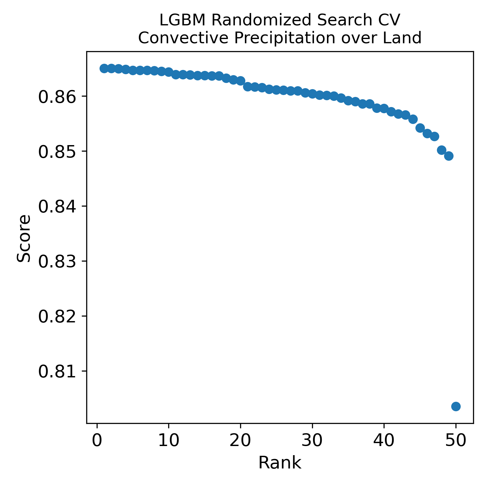

REVIEWER COMMENTS

Reviewer #1: This paper examines use of machine-learning for mitigating ground clutter in the GPM CORRA algorithm. While it is a similar approach to Hirose, using reflectivity profiles should be more consistent and more efficient than using precipitation profiles. This manuscript is also different in using machine learning, which can consider a much larger input space than a human could efficiently explore. This is a good paper, worthy of publishing in JTECH, I have only minor comments that can be addressed by providing additional discussion and another table or two.

Minor comments

1.	Fig. 2,3: What do different color lines mean, can you please add a legend or colorbar? 
    * The initially colors were automatically assigned by the plotting package, but the current coloring scheme is indicative of the FL height, with cooler colors (bluish) indicative of freezing levels close to the surface.  
2.	Fig. 4: Left axis label partly cutoff.
    * We re-ploted Fig. 4. 
3.	Line 188: It would help the reader to provide a table of predictors. I don't see the profile slope mentioned - was that a predictor?
    * No, the slope was not explicitly used as predictor.  Our assertion is that an effective ML model can extract information equivalent to the slope and therefore the features such as the slope do not need to be explicitly calculated.
4.	Line 247: If you want to guarantee that profile slope information was used, did you try a neural network with at least one 1D convolutional layer? If not, is there some reason this is difficult or a bad idea?
    * Variability in the number bins affected by clutter and their position relative to the freezing level make standard convolutional network unlikely to work.  Formulations that make effective use of masking exist and they are likely to eventually work.  However, given that masked convolutional networks are difficult to implement and study and are still evolving, we haven not tried such an approach in our study.
5.	Line 276: "Given that LGBM and NN models have good extrapolation capabilities" My experience has been not to trust NN models for extrapolation… but maybe decision tree-based models are different? Do you have a reference for this statement?
    * We agree with the reviewer that, generally speaking, the statement on line 276 is questionable.  What we meant was that, given that the in-range predictions did not exhibit obvious artifacts, we expected similar behavior for the small fraction of profiles requiring out-of-range predictions.  We acknowledge that extrapolation capabilities of machine learning models, including LGBM and NN, can vary and are often context-dependent.
6.	Line 284: I don't see any information about the number of samples (training and testing)? It would be most helpful to provide that information as function of stratiform/convective and land/ocean, since those are the categories you are considering - so maybe a table. I don't see information on the data used (e.g., time-period or orbit numbers, geographic restrictions).
    * Yes, we need to provide this information. 
7.	Line 306: I'm curious how much of the hyper-parameters space was evaluated for these models. Of course, NNs have tons of hyper-parameters, but knowing how many layers and how many units per layer that were explored would be helpful. For the tree-based LGBM and RF models, knowing how many estimators and how deep would be helpful. Also, I don't see where you provide information about the final model that you selected to produce the results.
    * For hyper-parameter optimization, we used the RandomizedSearchCV function in the sklearn package.  An example of analysis is presented in the following figure.  As apparent in the figure, there is not a lot of variability in the performance, although one configuration stands out as notable worse than others. The score used in the analysis is the correlation coefficient, which is the squared root of the default score used by the RandomizedSearchCV function for regression problems.  The final model was selected based on the best score.  We will add this information to the manuscript and upload the models to a public repository.

8.	Line 306: An advantage of tree-based models is that they provide interpretability. I'm curious whether your model follows your intuition in terms of the predictors it focused on, or where there any surprises - predictors that have been previously overlooked that machine learning found useful?
    * We did not find the tree-based models derived in the study to be particularly interpretable.  When the number of input parameters is not small, even tree-based models are difficult to interpret. The sklearn package provides a utility to print decision trees, but the number of nodes is overwhelmingly large and precludes an intuition-based analysis.  Ironically, NNs may be more interpretable because activation patterns in intermediate layers may enable a cluster analysis.  However, as mentioned earlier, the challenging aspect regarding NN in this particular problem is the variability in the clutter extent, which requires masking and complex architectures.

9.	Line 309: I'm curious how your conclusions might change if your benchmark was current Hirose approach rather than persistence?
    * While a definite answer can be derived only through a faithful implementation of the Hirose et al. approach, for any approach to be useful it must be more accurate than both persistence and the climatological scaling correction approaches. The ML formulations in our study appear to be effective in removing most of the biases associated with the persistence approach and reduce, to some degree, the Root Mean Squared Error (RMSE) relative to the climatological scaling correction. The Hirose et al. study provides some information on systematic changes (consistent with our findings) in the surface precipitation estimates, but no information on the RMSE performance. While ML approaches are not necessarily better than hand-crafted statistical models, there is no evidence that the opposite is true. 
10.	Line 391: Why the switch from persistence to climatological scaling correction as your benchmark?
    *  Persistence is used provide a baseline and illustrate the need for a correction that removes the bias, but cannot be used to investigate whether a method provides benefits beyond the bias removal.
11.	Figure 12: To me this looks like LGBM is providing value over the climatological scaling approach in terms of RMSE reduction, but it sounds like you are underwhelmed? You conclude that simple bias-removal methods are satisfactory, but is it true that those methods are as good as LGBM at removing mean biases?  
    * We thank the reviewer for the positive perspective and agree that LGBM is providing value over the climatological scaling approach. We just want to point out that the RMSE associated with the LGBM is still considerable, which suggests that, in general, the reduction in systematic errors is more readily achievable than that in the random errors.
12.	Fig. 15: "top panel" in caption - there is only one panel
    * Thank for pointing this out. We corrected it in the revised version of the manuscript.

Reviewer #2:
General Comments:

The article by Grecu et al. outlines a machine learning (ML)-based methodology for better understanding the relationship between surface precipitation rates and associated satellite reflectivity estimates above the radar blind zone. This is an important area of study as satellite clutter zones are large sources of observational uncertainty in past, current and future planned satellite precipitation missions. Grecu et al. examines a suite of ML regression models ranging from a random forest to a neural network and compares their ability to capture surface precipitation rates to traditional linear techniques. They find that while there is some reduction in overall bias and RMSE from the ML techniques, none perform significantly better than the most simplistic extrapolation. While one may hope to see significant improvements using ML, I feel these types of studies are important to share, as ML solutions are not necessarily appropriate across all problem spaces and have their
own sets of limitations. Exploring these limitations is critically important to understanding operational applicability. Less complex techniques are much more interpretable and therefore provide a layer of trust that can be lost in the complexity of a neural network, for instance. With this in mind, this work is of high quality and is of interest to the readers of JTECH. However, before I can recommend it for a full acceptance, I feel there are a few areas that need to be improved (specifically around the details of the ML models and the training dataset, which are both at the heart of this analysis). I have included a series of major comments, minors comments and specific comments below.

Main Comments:

I appreciate the content in Section 2.a outlining the dataset's structure and ML model features. However, since the ML component is central to the results, I would argue that this section needs significant refactoring. Specifically, I suggest adding a new subsection 2.b with more detail on the ML models. For example, how did you standardize the inputs for the NN? Did you use a holdback validation dataset? If not, why? Including the loss curves for the NN/LGBM models (either in the text or as supplemental material) would provide additional evidence against potential overfitting. Additionally, how were the hyperparameters on lines 255-260 determined? Did you use Bayesian search, hyperband, etc.? A parameter sweep might be beneficial and bring the NN closer to the performance of the LGBM. For the RF/LGBM models, you mention default parameters. Does this mean max_depth was set to None? If so, there may be overfitting concerns, and adjusting these values could help. In general, I
feel that a more in-depth examination of the ML architectures (and performing a few additional tests) while addressing these specific questions would provide valuable context when comparing to simpler linear extrapolation techniques.

Another major comment is regarding the sample size and data splitting. It wasn't totally clear to me, but was only one year of GPM data being used for training/testing? While one year of GPM data is substantial, there is much more available, and I feel incorporating some of this could potentially impact performance/results. More sophisticated techniques like the NN or LGBM often strongly benefit from a larger dataset by capturing additional complex nonlinear features missed by linear techniques, potentially reducing the noise in the first three columns of Fig. 10. This is especially true for NN's with multiple hidden layers. Expanding to multiple years might boost NN performance and improve predictions over different seasons as weather patterns shift year-to-year.  Additionally, when you state, "the DPR dataset is randomly split into a training and a testing dataset with 70% of profiles in the training dataset and the remaining 30% in the testing dataset," what do you mean
by profile? If you mean the vertical reflectivity bins for a single observation from the DPR, I would recommend not splitting randomly due to the auto-correlation of nearby profiles (e.g., training on a profile at timestep X and testing on timestep X+1 may lead to overfitting). Instead, I would recommend a paradigm of training on the first 80% of a month, holding the next 10% of days in a validation dataset, and the last 10% in the test dataset (or something equivalent). These types of splitting methods are much less prone to overfitting, as the atmosphere decouples much more strongly between training/testing datasets.

Finally, this comment ties in with comment 1, I believe additional referencing would better contextualize this research within the current literature. Currently, there are only a few references related to the ML processes being used, and those provided, such as Goodfellow et al., 2016, and Geron, 2022, are quite general and not particularly relevant to this specific application. Including references to recent papers like Chase et al., 2021, Ehsani et al., 2021, King et al., 2022, or Petković et al., 2019, would provide a stronger foundation for comparison and broaden the applicability of this work.

Minor Comments:

Line 196-197: For clarity, where does the surface precipitation rate come from, and what is its spatio-temporal resolution? Is this one of the derived GPM products? It would be interesting to see these results relate to in situ surface rates at a series of different stations over land, but that would likely be beyond this project.
Figure 2: What reflectivity units do you use to calculate the mean profiles here? Are the means produced in Z or dBZ space? Further, what reflectivity units are fed into the different ML models? Finally, what do the different colored lines represent? Perhaps a legend is needed here.
Lines 94-98: You mention one of the benefits of using ML techniques are the feature engineering capabilities of these systems, yet this isn't really discussed afterward. What did the RF feature importance scores tell you about the predictors? Further, you could also include an examination of the SHAP values from the NN to see if you get similar results. It would be interesting to see this discussed more, and then features related back to physical processes/relationships one might expect to see. Incorporating other atmospheric variables like temperature, humidity etc. in future work might also provide some useful/interesting context.

Line 188: A table summarizing the data going in/coming out of the models would be really helpful to keep track of their shapes, data types, origins, units, number of samples, reference papers etc.
Lines 200-230: It would also be helpful if you provided a simple model diagram/flow chart showing how the inputs are used to predict the surface rates across the different ML models versus the kNN interpolation or simple linear extrapolation techniques.
Correlation coefficient figures: I'm not sure if I fully understand why there exists a discontinuity in the correlation coefficients at bin 160. You mention this is related to mixed-phase cloud layers, but would this layer not shift slightly in its vertical position over time? Further, why is there a bimodality in the coefficients, with a spike in high correlations near the surface and then another spike around bin 170? What is the physical intuition behind this distribution?
To help visualize the results section more clearly, I wonder if including a representative case study or two with different atmospheric dynamics and varying LCFBs from the DPR, along with persistence-derived rates and the other ML model rates plotted alongside it would help better visualize things? I feel that might help make these correlation coefficient and bias plots clearer to interpret if we can see some actual examples.
Lines 269-280: I feel this description regarding the selection of the upper limit 26 is a bit verbose, and can likely be condensed.
Line 315: It might be useful to provide a sentence or two explaining the importance of the zero-degree bin in the context of the surface precipitation rate, as it isn't totally clear as to why this is such an important variable to consider from the outset of the paper.
Line 419: Have you looked at cases where the model performed exceptionally/poorly? Specifically, I am curious about extreme precipitation events? Typically, these models prefer to stay safe with their estimates and regress towards the mean value, which can often underestimate extreme events. I am curious if you see that pattern here as well?
Have you examined how this model performs with orographic precipitation? It might be good to mention something about this (even just as followup work), as it is a very active area of research.
Fig 12: It might be useful to plot the stratiform and convective cases next to one another for easy comparison? It would also be good to include the mean bias and R^2 values as well to get a more comprehensive view of the model skill.
Lines 405-409: This is an interesting application and I would recommend making reference to a recent paper by King et al., 2024 that looks at this topic in more detail (i.e., using a U-Net with spaceborne radar and additional atmospheric variables to reconstruct blind zone reflectivity profiles).
Data availability and reproducibility: I am wondering if there is a public GitHub repository or equivalent containing some of the code for running these models? Even better is a Google Colab set up with some example test data that can be run, so others can easily adapt and build upon the results of this study if possible.

Specific Comments:

Line 14: I would define machine learning in the abstract first for clarity (some in this field see ML and think melting layer).
Line 37: "has as" should be "has a".
Line 94: You go back and forth using ML and Machine Learning, I'd stick to just one way for consistency.
Figure 4: The y-axis label is cut off here on the left.
Line 111: Why is there only a single subsection in Methodology, shouldn't there be a part b) to justify the part a)? I would also rename this subsection to something more specific.
Line 172: "This behavior may used" to "This behavior may be used"
Figure 14: What does CMB stand for? It isn't defined from what I can see above.
Line 235: There is a missing space after rate

References:

Chase, R. J., S. W. Nesbitt, and G. M. McFarquhar, 2021: A Dual-Frequency Radar Retrieval of Two Parameters of the Snowfall Particle Size Distribution Using a Neural Network. J. Appl. Meteor. Climatol., 60, 341-359, https://gcc02.safelinks.protection.outlook.com/?url=https%3A%2F%2Fdoi.org%2F10.1175%2FJAMC-D-20-0177.1&data=05%7C02%7Cmircea.grecu-1%40nasa.gov%7C0927ec2444874ce4ffd108dc8fae650f%7C7005d45845be48ae8140d43da96dd17b%7C0%7C0%7C638543226386808407%7CUnknown%7CTWFpbGZsb3d8eyJWIjoiMC4wLjAwMDAiLCJQIjoiV2luMzIiLCJBTiI6Ik1haWwiLCJXVCI6Mn0%3D%7C0%7C%7C%7C&sdata=FCsH4vIl6GRl3Dv%2BLCgjl3Vx529NMjCzDL2cOZCLVOA%3D&reserved=0.

Ehsani, M. R., A. Behrangi, A. Adhikari, Y. Song, G. J. Huffman, R. F. Adler, D. T. Bolvin, and E. J. Nelkin, 2021: Assessment of the Advanced Very High Resolution Radiometer (AVHRR) for Snowfall Retrieval in High Latitudes Using CloudSat and Machine Learning. J. Hydrometeor., 22, 1591-1608, https://gcc02.safelinks.protection.outlook.com/?url=https%3A%2F%2Fdoi.org%2F10.1175%2FJHM-D-20-0240.1&data=05%7C02%7Cmircea.grecu-1%40nasa.gov%7C0927ec2444874ce4ffd108dc8fae650f%7C7005d45845be48ae8140d43da96dd17b%7C0%7C0%7C638543226386812464%7CUnknown%7CTWFpbGZsb3d8eyJWIjoiMC4wLjAwMDAiLCJQIjoiV2luMzIiLCJBTiI6Ik1haWwiLCJXVCI6Mn0%3D%7C0%7C%7C%7C&sdata=uMqKFHhJAIDdqSusuDQGz4NaMEVYT8ubq3DDkbqj774%3D&reserved=0.

Geron, A., 2022: Hands-on machine learning with Scikit-Learn, Keras, and TensorFlow. " O'Reilly Media, Inc."

Goodfellow, I., Y. Bengio, and A. Courville, 2016: Deep learning. MIT press.

King, F., Duffy, G., Milani, L., Fletcher, C. G., Pettersen, C., and Ebell, K.: DeepPrecip: a deep neural network for precipitation retrievals, Atmos. Meas. Tech., 15, 6035-6050, https://gcc02.safelinks.protection.outlook.com/?url=https%3A%2F%2Fdoi.org%2F10.5194%2Famt-15-6035-2022&data=05%7C02%7Cmircea.grecu-1%40nasa.gov%7C0927ec2444874ce4ffd108dc8fae650f%7C7005d45845be48ae8140d43da96dd17b%7C0%7C0%7C638543226386816351%7CUnknown%7CTWFpbGZsb3d8eyJWIjoiMC4wLjAwMDAiLCJQIjoiV2luMzIiLCJBTiI6Ik1haWwiLCJXVCI6Mn0%3D%7C0%7C%7C%7C&sdata=YQP%2FG%2F0AwnKIezaSwgy4oKtyZYrsmVFs55lljqmGCPI%3D&reserved=0, 2022.

King, F., C. Pettersen, C. G. Fletcher, and A. Geiss, 2024: Development of a full-scale connected U-Net for reflectivity inpainting in spaceborne radar blind zones. Artif. Intell. Earth Syst., https://gcc02.safelinks.protection.outlook.com/?url=https%3A%2F%2Fdoi.org%2F10.1175%2FAIES-D-23-0063.1&data=05%7C02%7Cmircea.grecu-1%40nasa.gov%7C0927ec2444874ce4ffd108dc8fae650f%7C7005d45845be48ae8140d43da96dd17b%7C0%7C0%7C638543226386820305%7CUnknown%7CTWFpbGZsb3d8eyJWIjoiMC4wLjAwMDAiLCJQIjoiV2luMzIiLCJBTiI6Ik1haWwiLCJXVCI6Mn0%3D%7C0%7C%7C%7C&sdata=wCs7yWYXnWKkTaqGhomS83xTnnBuHkQqlN6exFgrk30%3D&reserved=0, in press.

Petković, V., M. Orescanin, P. Kirstetter, C. Kummerow, and R. Ferraro, 2019: Enhancing PMW Satellite Precipitation Estimation: Detecting Convective Class. J. Atmos. Oceanic Technol., 36, 2349-2363, https://gcc02.safelinks.protection.outlook.com/?url=https%3A%2F%2Fdoi.org%2F10.1175%2FJTECH-D-19-0008.1&data=05%7C02%7Cmircea.grecu-1%40nasa.gov%7C0927ec2444874ce4ffd108dc8fae650f%7C7005d45845be48ae8140d43da96dd17b%7C0%7C0%7C638543226386824232%7CUnknown%7CTWFpbGZsb3d8eyJWIjoiMC4wLjAwMDAiLCJQIjoiV2luMzIiLCJBTiI6Ik1haWwiLCJXVCI6Mn0%3D%7C0%7C%7C%7C&sdata=i3t3qZ0%2F21z4pX3DdmLnOkktmQ4jNlmtILXDA6pRDCA%3D&reserved=0.

Reviewer #3: The study correctly presents and acknowledges the challenges relevant to the spaceborne radar ground clutter problem - a well-recognized topic of high interest to precipitation community. While one could say the authors choose to focus on a "low hanging fruit" [considering a number of ML-based approaches but performing relatively straightforward training, and limiting the results to a single model limited spatio-temporal domain (single winter season over CONUS) despite the global applicability of presented techniques], the presented material is of high quality and offers a valuable contribution to the current state of the field. Potential for expanding the work presented here is outstanding, especially when having the ML approach in mind. This said, the manuscript provides a well-written description of what is a well-constructed study, which will undouble serve as an excellent starting point for further investigations. With some minor revisions (see detailed
comments below), and assuming the replies to my comments are in line with what it seems to be the case, the manuscript is close to receiving publication recommendation. I recommend minor revision at this time.

COMMENTS (major comments are marked with asterisk):

Title: Do you think there should be "Effects" after the "Ground Clutter"? The clutter is not in the algorithm nor in the estimates.

Line 16: clutter-free

Line 29: add 'in' after 'biases'

Line 27: 'as' into 'a'

Line 42: '(50853)'

Line 52: consider saying "… flux and reflected power changes."

Figure 1: add info on GPM orbit and date to the caption.

Line 102-104, last sentence of the paragraph: I don't think this sentence adds to the content.

Section 2: It seems that this section is missing subsections titles. Alternatively, you could just remove the 'a. General considerations' on line 112.

Line 112: Why are you referring to the "above the sea"? So far, in the Intro section, the focus was on the ground clutter with terrain in mind. Remove the "above the sea level", it is unnecessary and confusing. Or add a sentence to provide reasoning first (it comes later in this section, which is ok).

Figure 2: Expand the caption to include complete information on where the data is coming from (i.e., time period and product name). Also, add a legend to explain the colors of each line.

Line 146: Should there be 'level' after "0 C'?

Line 147: Acronym LCFB is not define till line 191.

*Methodology, lines 148-151: If the minimum value of H1 is 1km, then the climatology of the ratio between H1 and H2 never considers the lowest 1000m above the ground level, correct? If so, then the correction will never account for a presence of "dry conditions" (when relative humidity in the lowest bins is below 100%) that result in evaporation and reduction of precipitation rate (i.e., virga). This needs to be discussed in Methodology, Validation and Summery sections.

Methodology Section: As is, the Methodology section suggest that the method is developed and applicable to stratiform cases only. This is not true, but it becomes obvious only later in the text.

Line 170: "accounting" into "account"

Line 166-167: Consider saying  "Specifically, Iguchi et al. (2021) used…", or say "is used by Iguchi et al…". As is, the sentence is odd.

Line 172: "be" after "may", unless I misunderstood the point.

Line 178: Remove "of the figures"

Line 180: This would be a good place to start a new sub-section.

Line 188: Consider saying "… the design matrix (i.e., input features)…"

Line 199: Remove 'initially'

Line 230: New sub-section here?

Line 247: Would "supported by" be a better phrase than "based on"?

Line 250: 'and' into ','

Lines 248-262: Remove the statements on the complexity of setting a specific model (e.g., line 249: "… models requires minimal specifications …") - those are subjective and irrelevant for the study.

*Lines 267-269: So, you are using over-the-sea extrapolated observations to train the models to retrieve both the over-the-sea and over-the-land clutter-affected precipitation rate profile? If so, this would be a good place to stress it one more time and make it clear to the reader. Of course, the suggested belief that land vs. ocean near surface profiles are similar is a pretty large assumption, and perhaps the weakest point of the study. Yet, if clearly disclosed, reader's focus will be on the methodology that can readily be applied to any dataset as soon as it becomes available - which (my understanding is) is the main value of this study. Correct me if I am wrong.

Line 269: Consider starting a new paragraph here.

Figure 5: Add information on the data source to the caption (time period, domain)

*Lines 284-289: By using a random split of the dataset into training and testing, the testing group is not necessarily independent from the training. NN model can potentially "memorize" the storms within which all the elements in the testing dataset have occurred, instead of learning the relationships. While decision tries may not suffer from this problem, the NN models will do. Please provide more info (in your response to this comment) on how you construct the train/validation/test split for NN model listed on lines 246-247.

*Lines 295-298: Please comment on the following: Nothing prevents you from using additional input features (e.g., relevant modeled data) to further test this "hypothesis", as this is an important aspect of the study. Also, fully "synthetic" datasets (e.g., modeled reflectivity profiles and corresponding environment parameters offered through numerical model products) are in fact ready-to-use-datasets (all data points are already collocated). While using such datasets for training may not provide the results that are as good as the one you are generating by using observations, they should be perfectly suitable for determining which ML approach is the best for the task.

*Line 300: The justification for "eliminating" the NN model is weak. Listing a "slow training" as a downside of an approach is an overstatement. How long does it really take to train a NN model you considered here? One can easily argue that anything shorter than a couple of weeks on modern GPUs should not be considered to be long (for a ML-oriented study such this one). Training is performed during the development phase only. Inference is typically extremely fast, even with a large number of trained parameters. Ensuring the overfitting is not taking place is one of few expected tasks when it comes to ML training of NNs. Consider providing a different justification for not going forward with the NN model (e.g., you could say that the complexity of the model is higher than the LGBM, or it a more of a "black box" compared to the LGBM, …).

Line 309: Consider using a different word than 'persistence' here, as the term is not introduced till line 319.

*Figs 6-11: Would the plots look the same if the x-axis is "zero-degree bin-above-surface" (instead of just zero-degree bin-number)? Currently, the plots do not provide information on the space between the surface and freezing level, which from everything shown here is important.

*Figs 6-11: Did you investigate what is going on with the zero degree bin 160 ? Why the jump in the relationship with LCFB?

*Figs 6-11: Can you provide a corresponding sample size plots?

Fig. 12: Consider reordering the bars to place the same precip type next to each other (e.g., blue, green, orange, red).

*Lines 417-419: The sentence states: "… the focus of this study is on  fundamental benefits and limitations of profile level corrections rather than their climatological impact". If so, then this must be clearly stated much earlier in the text, no later than the end of the Introduction section. In fact, this is the first time in the manuscript that the focus of the study is clearly defined.

Figure 14: Make the legend and caption consistent (in the legend clearly say which line is CORA and which one is LGBM). Consider combining the two plots into one, using a secondary axes to show the umber sample. Add info on time period and region into the caption (you may want to do this in Fig 13, and then reference it here).

Figure 15: There is only one panel in this figure. Correct text in the caption (i.e., remove "top panel"). Add info on time period and region into the caption (or say, "same as in Fig. 14).

Line 474: Consider rewording the part of the sentence after the comma.

*Lines 480-481: If true, consider adding "ocean vs. over land? Or both? This remains unclear.

Line 484: Consider spelling out the FLH and other acronyms in this section (some readers may read only the summary).

